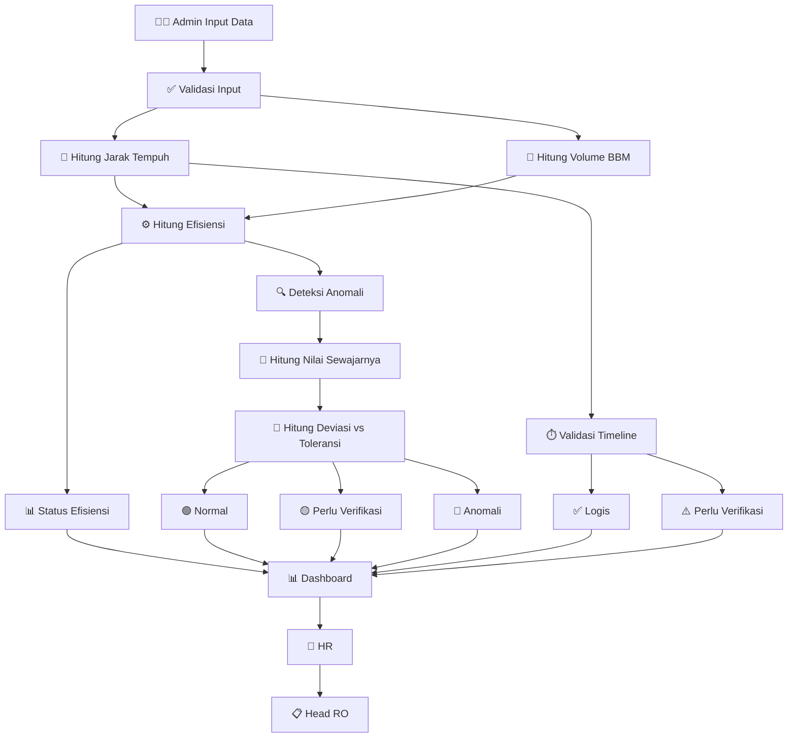
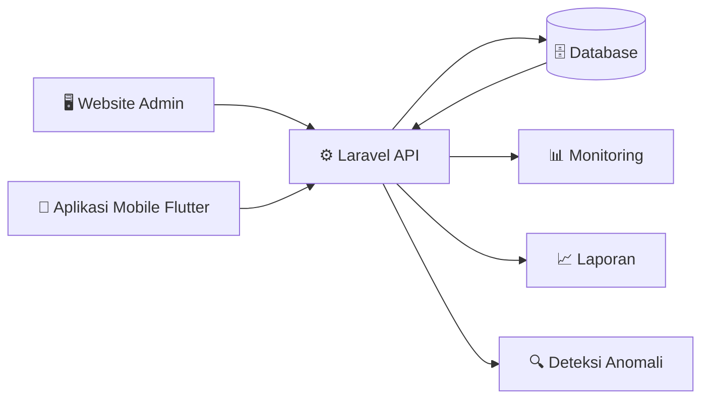
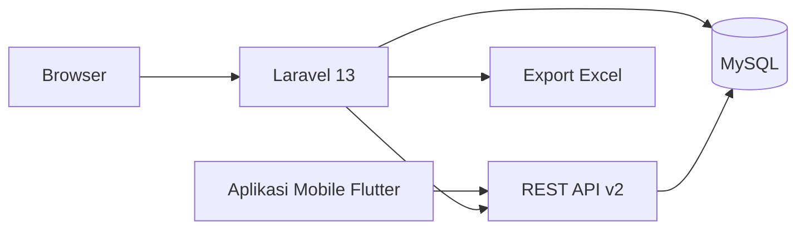

<div align="center">

# Sistem Monitoring BBM Kendaraan Operasional

<br/>

<table border="0" cellspacing="0" cellpadding="0">
  <tr>
    <td align="center" style="padding: 0 20px;">
      
      <br/>
      <b>PT. Telkom Akses Binjai</b>
    </td>
    <td align="center" style="padding: 0 20px; font-size: 28px; font-weight: bold; color: #888;">
      ×
    </td>
    <td align="center" style="padding: 0 20px;">
      
      <br/>
      <b>Universitas Negeri Padang</b>
    </td>
  </tr>
</table>

<br/>


**Proyek Magang Mahasiswa Informatika**

**Ramzy Junfaris Hamonangan**
Program Studi Informatika · Fakultas Teknik · Universitas Negeri Padang

</div>

---

## 📋 Tentang Proyek

Sistem Monitoring BBM Kendaraan Operasional merupakan aplikasi berbasis web yang dikembangkan untuk membantu proses **pencatatan, monitoring, dan evaluasi** penggunaan bahan bakar kendaraan operasional di PT. Telkom Akses Binjai.

Sistem ini dibangun sebagai bagian dari kegiatan **Magang Mahasiswa Universitas Negeri Padang** dan telah melalui proses diskusi serta validasi kebutuhan bersama pihak HR dan Head of Regional Office (Head RO) PT. Telkom Akses Binjai.

Aplikasi dirancang untuk **menggantikan proses pencatatan manual** sehingga data penggunaan BBM dapat terdokumentasi dengan lebih rapi, terstruktur, dan mudah dianalisis.

Seiring perkembangan proyek, aplikasi kini telah mendukung cakupan yang lebih luas, meliputi:

- 📊 **Monitoring Operasional** — pencatatan dan pemantauan penggunaan BBM kendaraan operasional
- 📈 **Pelaporan** — rekapitulasi dan export laporan bulanan
- 🔌 **REST API** — integrasi data untuk aplikasi mobile Flutter
- 📄 **Pelaporan Excel** — export laporan bulanan mengikuti format pelaporan PT. Telkom Akses
- 🔍 **Deteksi Anomali Otomatis** — validasi jarak tempuh vs nilai sewajarnya dengan toleransi 40%
- ⏱️ **Validasi Timeline Odometer** — deteksi odometer mundur berdasarkan urutan kronologis

> 🚧 **Catatan:** Saat ini sistem sedang berada dalam tahap **verifikasi internal** oleh pihak **HR** dan **Head of Regional Office (Head RO)** PT. Telkom Akses Binjai, sebelum masuk ke tahap deployment produksi.

---

## 🔍 Latar Belakang

Pengelolaan BBM kendaraan operasional merupakan salah satu aktivitas rutin yang dilakukan oleh perusahaan. Pada proses sebelumnya, pencatatan masih dilakukan secara **manual menggunakan bon pembelian dan pencatatan kilometer** kendaraan sehingga:

| # | Permasalahan |
|---|---|
| 1 | ❌ Sulit melakukan monitoring penggunaan BBM |
| 2 | ❌ Sulit mengetahui kendaraan yang boros |
| 3 | ❌ Sulit melakukan rekapitulasi laporan |
| 4 | ❌ Berpotensi terjadi kesalahan pencatatan |
| 5 | ❌ Membutuhkan waktu lebih lama dalam proses evaluasi |

Oleh karena itu dibangun sistem informasi yang mampu membantu proses pencatatan sekaligus monitoring penggunaan BBM kendaraan operasional.

---

## 🎯 Tujuan Pengembangan

- ✅ Mempermudah pencatatan penggunaan BBM kendaraan operasional
- ✅ Menyimpan dokumentasi bon BBM secara digital
- ✅ Menghitung penggunaan BBM secara otomatis
- ✅ Menghitung efisiensi kendaraan berdasarkan jarak tempuh
- ✅ Menampilkan dashboard monitoring penggunaan BBM
- ✅ Membantu HR dan Supervisor melakukan evaluasi penggunaan kendaraan
- ✅ Menyediakan REST API untuk aplikasi mobile Flutter
- ✅ Deteksi anomali otomatis berdasarkan deviasi dari nilai sewajarnya

---

## ⚡ Fitur Utama

<table>
  <tr>
    <th>🗂️ Manajemen Data</th>
    <th>📊 Monitoring BBM</th>
    <th>📄 Dokumentasi</th>
    <th>📈 Laporan</th>
    <th>🔌 API</th>
    <th>🔍 Validasi</th>
  </tr>
  <tr>
    <td>Data Pegawai</td>
    <td>Volume BBM Otomatis</td>
    <td>Upload Foto Bon</td>
    <td>Rekap Penggunaan BBM</td>
    <td>API Data Perjalanan</td>
    <td>Status Efisiensi (Balance/Boros/Anomali)</td>
  </tr>
  <tr>
    <td>Data Kendaraan</td>
    <td>Perhitungan Jarak Tempuh</td>
    <td>Nomor Bon</td>
    <td>Rekap Efisiensi Pegawai</td>
    <td>API Rekap Monitoring</td>
    <td>Status Validasi (Normal/Perlu Verifikasi/Anomali)</td>
  </tr>
  <tr>
    <td>Data Perjalanan</td>
    <td>Efisiensi Kendaraan</td>
    <td>Riwayat Perjalanan</td>
    <td>Dashboard Monitoring (Operational Dashboard)</td>
    <td>API Detail Perjalanan</td>
    <td>Validasi Timeline Odometer</td>
  </tr>
  <tr>
    <td>Data Pembelian BBM</td>
    <td>Status Balance / Boros / Anomali</td>
    <td></td>
    <td>Export Excel Bulanan (Format PT. Telkom Akses)</td>
    <td>Filter & Pagination</td>
    <td>Deteksi Anomali (deviasi vs toleransi 40%)</td>
  </tr>
</table>

### Status Monitoring Kendaraan

| Status | Tipe | Indikator | Keterangan |
|--------|------|-----------|------------|
| 🟢 **Balance** | Efisiensi | Efisiensi normal | Penggunaan BBM sesuai standar |
| 🟡 **Boros** | Efisiensi | Konsumsi tinggi | Penggunaan BBM di atas rata-rata |
| 🔴 **Anomali** | Efisiensi | Perlu investigasi | Efisiensi di luar batas wajar |
| 🟢 **Normal** | Validasi | Data wajar | Tidak ada deviasi signifikan |
| 🟡 **Perlu Verifikasi** | Validasi | Deviasi moderat | Selisih 1-2× batas toleransi |
| 🔴 **Anomali** | Validasi | Deviasi tinggi | Selisih >2× batas toleransi |

> ⚠️ Status Efisiensi mengukur konsumsi BBM (km/L). Status Validasi mengukur kewajaran jarak tempuh terhadap nilai sewajarnya. Keduanya bersifat indikator monitoring, bukan alat pembuktian kecurangan.

---

## 🧮 Algoritma Perhitungan

### Jarak Tempuh
```
Jarak Tempuh = KM Akhir - KM Awal
```

### Volume BBM
```
Volume BBM = Nominal Bon / Harga Per Liter
```

### Efisiensi Kendaraan
```
Efisiensi = Jarak Tempuh / Volume BBM
```

### Nilai Sewajarnya (Estimasi Jarak)
```
Efisiensi Wajar = (Batas Balance + Batas Anomali Atas) / 2
Nilai Sewajarnya = Volume BBM × Efisiensi Wajar
```

Nilai sewajarnya menggunakan **titik tengah (midpoint)** antara batas balance dan batas anomali atas, bukan batas minimum:

| Tipe BBM | Balance (min) | Anomali Atas (maks) | Midpoint (yang dipakai) |
|----------|:-:|:-:|:-:|
| R4 Pertalite | 10 km/L | 20 km/L | 15 km/L |
| R4 Solar/Dex | 6 km/L | 14 km/L | 10 km/L |
| R2 | 25 km/L | 60 km/L | 42.5 km/L |

### Deviasi & Toleransi
```
Deviasi = |Nilai Sewajarnya - Jarak Aktual|
Toleransi = 40% × Nilai Sewajarnya
Rasio Deviasi = Deviasi / Toleransi
```

### Status Validasi
| Rasio Deviasi | Status |
|:-------------:|--------|
| ≤ 1.0 | 🟢 Normal |
| 1.0 – 2.0 | 🟡 Perlu Verifikasi |
| > 2.0 | 🔴 Anomali |

### Contoh Perhitungan

```
KM Awal       : 12.450 km
KM Akhir      : 12.680 km
Nominal Bon   : Rp 150.000
Harga/Liter   : Rp 10.000
Tipe BBM      : Pertalite (R4)

─────────────────────────────────────
Jarak Tempuh     : 12.680 - 12.450 = 230 km
Volume BBM       : 150.000 / 10.000 = 15 liter
Efisiensi        : 230 / 15 = 15,3 km/liter → 🟢 Balance
Nilai Sewajarnya : 15 × 15 = 225 km
Deviasi          : |225 - 230| = 5 km
Toleransi        : 40% × 225 = 90 km
Rasio Deviasi    : 5 / 90 = 0.06 → 🟢 Normal
```

---

## 🔄 Alur Sistem



---

## 🔌 Alur API



---

## 🏗️ Arsitektur Sistem



---

## 🛠️ Teknologi yang Digunakan

### Backend
| Teknologi | Versi | Peran |
|-----------|-------|-------|
| PHP | 8.3 | Runtime backend |
| Laravel | 13 | Framework utama |

### Database
| Teknologi | Peran |
|-----------|-------|
| MySQL / MariaDB | Penyimpanan data utama |

### Frontend
| Teknologi | Peran |
|-----------|-------|
| Blade Template | Template engine Laravel |
| Custom CSS | Styling modern (Card UI, animasi, responsive) |

### Library Tambahan
| Library | Peran |
|---------|-------|
| Laravel Excel | Export laporan Excel bulanan |
| Laravel Tinker | Debugging & REPL |

### API
| Jenis | Format |
|-------|--------|
| REST API Laravel (v2) | JSON Response |

---

## 💻 Instalasi

### Kebutuhan Sistem
| Software | Versi |
|----------|-------|
| PHP | ^8.3 |
| Laravel | ^13.8 |
| MySQL / MariaDB | 8.0+ / 10.5+ |
| Composer | ^2.5 |
| Node.js (opsional) | ^18 |

### Langkah Instalasi
```bash
# 1. Clone repository
git clone <repository-url> bensin-monitoring
cd bensin-monitoring

# 2. Install dependensi PHP
composer install

# 3. Salin file environment
cp .env.example .env

# 4. Generate application key
php artisan key:generate

# 5. Konfigurasi database di .env
#    Edit DB_DATABASE, DB_USERNAME, DB_PASSWORD

# 6. Jalankan migrasi database
php artisan migrate

# 7. Buat storage link
php artisan storage:link

# 8. Build assets (jika diperlukan)
npm install && npm run build

# 9. Jalankan development server
php artisan serve
```

### Import Database
Jika Anda memiliki dump database yang sudah ada:
```bash
# Import dari file SQL
mysql -u username -p bensin_monitoring < backup.sql

# Jalankan migrasi yang tertunda
php artisan migrate
```

### Konfigurasi Environment
> Untuk deployment produksi, lihat [DEPLOYMENT.md](DEPLOYMENT.md).

---

## 🏗️ Arsitektur Proyek

### Layer Architecture
```
┌─────────────────────────────────────────────────────┐
│  Routes (web.php / api.php)                         │
├─────────────────────────────────────────────────────┤
│  Controllers                                        │
│  ┌───────────────────────────────────────────────┐  │
│  │  Form Requests (Validasi)                     │  │
│  ├───────────────────────────────────────────────┤  │
│  │  Service Layer (Logika Bisnis)                │  │
│  │  ├── PerjalananService     (Orkestrator)      │  │
│  │  ├── DashboardService      (Statistik Cache)  │  │
│  │  ├── EfisiensiService      (Perhitungan)      │  │
│  │  ├── ValidasiService       (Validasi)         │  │
│  │  ├── TimelineService       (Cek Odometer)     │  │
│  │  ├── FraudService          (Deteksi Anomali)  │  │
│  │  └── AnomalyDetectionService (Scan Realtime)  │  │
│  ├───────────────────────────────────────────────┤  │
│  │  Models (Eloquent ORM)                        │  │
│  ├───────────────────────────────────────────────┤  │
│  │  Database (MySQL / MariaDB)                   │  │
│  └───────────────────────────────────────────────┘  │
└─────────────────────────────────────────────────────┘
```

### Service Layer
Logika bisnis telah dipisahkan dari controller dan model ke dalam kelas service tersendiri:

| Service | Tanggung Jawab |
|---------|-----------------|
| `PerjalananService` | Mengorkestrasi CRUD perjalanan, pembentukan payload, data chart, rekap |
| `DashboardService` | Menyediakan statistik dashboard yang di-cache |
| `EfisiensiService` | Perhitungan efisiensi BBM (jarak, volume, status) |
| `ValidasiService` | Aturan validasi (duplikasi bon, pengecekan nominal) |
| `TimelineService` | Validasi timeline odometer |
| `FraudService` | Deteksi anomali, indikator verifikasi |
| `AnomalyDetectionService` | Perhitungan ulang anomali secara realtime untuk tampilan |

### Caching
- Statistik dashboard di-cache selama 5 menit menggunakan `Cache::remember()`
- Cache key: `dashboard_stats`

### Index Database
Index performa ditambahkan pada kolom yang sering di-query:
- `perjalanans`: `pegawai_id`, `tanggal`, `status_efisiensi`, `no_bon`, `km_baru`, `km_lama`
- `pegawais`: `nama`
- `kendaraans`: `plat_nomor`, `merk`

### Validasi Form Request
Seluruh validasi controller dipindahkan ke kelas Form Request khusus:
- `StorePerjalananRequest` / `UpdatePerjalananRequest`
- `StoreKendaraanRequest` / `UpdateKendaraanRequest`
- `StorePegawaiRequest` / `UpdatePegawaiRequest`

---

## 👥 Struktur Pengguna Sistem

```
┌─────────────────────────────────────────────────────────┐
│                     SISTEM BBM                          │
│                                                         │
│  🔧 Admin BBM      👤 HR           🔍 Supervisor        │
│  ─────────────    ─────────────   ─────────────────     │
│  Input Data BBM   Monitoring BBM  Monitor Kendaraan     │
│  Upload Bon       Rekapitulasi    Monitor Efisiensi     │
│  Kelola Trip      Data                                  │
│                                                         │
│                   📋 Head RO                            │
│                   ─────────────────                     │
│                   Dashboard Monitor                     │
│                   Evaluasi Operasional                  │
└─────────────────────────────────────────────────────────┘
```

---

## 🔌 REST API v2

REST API v2 (unversioned) tersedia untuk mendukung aplikasi mobile Flutter dan integrasi sistem lain.

| Method | Endpoint | Keterangan | Parameter |
|--------|----------|------------|-----------|
| GET | `/api/perjalanan` | Daftar perjalanan (paginated) | `per_page`, `pegawai_id`, `kendaraan_id`, `status`, `status_validasi`, `tanggal_dari`, `tanggal_sampai` |
| POST | `/api/perjalanan` | Tambah perjalanan baru | JSON body |
| GET | `/api/perjalanan/{id}` | Detail perjalanan | — |
| GET | `/api/perjalanan/rekap` | Rekap monitoring | `tanggal_dari`, `tanggal_sampai` |

### Format Response (GET /api/perjalanan)

```json
{
  "message": "Data perjalanan berhasil diambil.",
  "data": [
    {
      "id": 1,
      "tanggal": "2026-06-03",
      "pegawai": { "id": 1, "nama": "ramzy" },
      "kendaraan": { "id": 3, "plat_nomor": "B 9868 TAZ", "jenis": "R4" },
      "tujuan": "Lokasi Stabat",
      "uraian": "BIAYA BENSIN OPERASIONAL",
      "odometer": {
        "km_lama": 65320,
        "km_baru": 65431,
        "jarak_km": 111
      },
      "bbm": {
        "vol_liter": 10.1,
        "harga_per_liter": 10000,
        "jumlah_biaya": 101000,
        "no_bon": null,
        "foto_bon": null,
        "foto_bon_url": null
      },
      "monitoring": {
        "efisiensi": 10.99,
        "status_efisiensi": "balance",
        "status_reason": "...",
        "fraud_score": 10,
        "fraud_flags": { ... }
      },
      "status_validasi": "Normal",
      "nilai_sewajarnya": 151.5,
      "deviasi_km": 40.5,
      "keterangan_validasi": "...",
      "timeline_status": "Logis",
      "alasan_timeline": null,
      "display_flags": [],
      "created_at": "2026-06-23 10:38:50",
      "updated_at": "2026-07-13 02:14:41"
    }
  ],
  "meta": {
    "current_page": 1,
    "last_page": 10,
    "per_page": 15,
    "total": 150
  }
}
```

### Alias Root-level untuk Flutter

| Field | Sumber | Tipe |
|-------|--------|------|
| `status_validasi` | `fraud_flags.status_anomali` | string (Normal / Perlu Verifikasi / Anomali) |
| `nilai_sewajarnya` | `fraud_flags.hasil_sewajarnya` | float |
| `deviasi_km` | `fraud_flags.deviasi` | float |
| `keterangan_validasi` | `fraud_flags.keterangan_anomali` | string |
| `timeline_status` | `fraud_flags.timeline_status` | string |
| `alasan_timeline` | `fraud_flags.alasan_timeline` | string? |
| `display_flags` | `fraud_flags.display_flags` | string[] |

### Filter `status_validasi`

```
GET /api/perjalanan?status_validasi=Normal
GET /api/perjalanan?status_validasi=Perlu+Verifikasi
GET /api/perjalanan?status_validasi=Anomali
```

> Seluruh endpoint mengembalikan response dalam format **JSON**.

---

## 🗺️ Roadmap Pengembangan

### ✅ Tahap 1 — Core System (Selesai)

- [x] CRUD Pegawai
- [x] CRUD Kendaraan
- [x] CRUD Perjalanan
- [x] Upload Bon BBM
- [x] Monitoring Efisiensi (Balance / Boros / Anomali)
- [x] Dashboard Monitoring
- [x] Export Excel Bulanan

### ✅ Tahap 2 — REST API & Validasi (Selesai - v2.1)

- [x] REST API unversioned (v2)
- [x] Pagination & filter API (pegawai, kendaraan, tanggal, status)
- [x] Filter `status_validasi` (Normal / Perlu Verifikasi / Anomali)
- [x] Deteksi Anomali (deviasi vs nilai sewajarnya, toleransi 40%)
- [x] Validasi Timeline Odometer (kronologis berdasarkan tanggal)
- [x] Alias response root-level untuk Flutter
- [x] Perbaikan model Kendaraan (mapping jenis/tipe)
- [x] Hapus V1 API & dead code
- [x] Redesain mobile UI

### 🔎 Tahap Saat Ini — Verifikasi Internal

- [x] Validasi oleh HR
- [x] Validasi oleh Head of Regional Office (Head RO)
- [x] Pengumpulan feedback sebelum deployment produksi

### 🔄 Tahap 3 — Pelaporan Lanjutan (Dalam Rencana)

- [x] Export Microsoft Exel

### 📱 Tahap 4 — Mobile & Deployment (Direncanakan)

- [x] Aplikasi Mobile Flutter (konsumsi REST API)
- [x] Dashboard Monitoring Mobile

---

## 🚀 Deployment

Untuk kebutuhan deployment produksi (spesifikasi server, konfigurasi Nginx, setup queue worker, checklist keamanan), lihat:

👉 **[DEPLOYMENT.md](DEPLOYMENT.md)**

### Ringkasan Kebutuhan Deployment
| Komponen | Kebutuhan |
|-----------|-------------|
| Web Server | Nginx 1.20+ |
| PHP | 8.3+ dengan ekstensi yang diperlukan |
| Database | MySQL 8.0+ / MariaDB 10.5+ |
| RAM | Minimum 2GB, direkomendasikan 4GB+ |
| Storage | Minimum 10GB ruang kosong |
| Queue | Database driver (opsional) |

---

## 🛠️ Instalasi Lokal (Development)

### Prasyarat
- PHP 8.3+
- Composer 2.5+
- Node.js 18+ & npm
- MySQL 8.0+ / MariaDB 10.5+

### Langkah Instalasi

```bash
# 1. Clone repositori
git clone <repository-url> bensin-monitoring
cd bensin-monitoring

# 2. Install dependensi PHP
composer install

# 3. Install dependensi frontend & build asset
npm install
npm run build

# 4. Konfigurasi environment
cp .env.example .env
php artisan key:generate
# Edit .env sesuai konfigurasi database lokal

# 5. Jalankan migrasi dan seeder
php artisan migrate --seed

# 6. Buat storage link
php artisan storage:link

# 7. Jalankan development server
php artisan serve
```

Akses aplikasi di `http://localhost:8000`.

### Data Dummy
Seeder menyediakan data dummy untuk demo:
- **6 Pegawai** (Manager, Supervisor, Staff, Driver)
- **6 Kendaraan** (R4 dan R6, bensin dan solar)
- **24 Perjalanan** mencakup 3 bulan terakhir (termasuk 4 data anomali untuk demo deteksi fraud)

Untuk mengisi ulang data dummy:
```bash
php artisan migrate:fresh --seed
```

---

## 🚦 Status Proyek

> 🚧 **Development & Verifikasi Internal**
>
> Proyek ini dikembangkan sebagai bagian dari kegiatan Magang Mahasiswa Universitas Negeri Padang di PT. Telkom Akses Binjai, dan saat ini sedang berada dalam tahap **verifikasi internal oleh HR dan Head of Regional Office (Head RO)** sebelum masuk ke tahap deployment produksi.

---

## 👨‍💻 Pengembang

<div align="center">

| | |
|---|---|
| **Nama** | Ramzy Junfaris Hamonangan |
| **Program Studi** | Informatika |
| **Fakultas** | Teknik — Universitas Negeri Padang |
| **Kegiatan** | Proyek Magang PT. Telkom Akses Binjai |
| **Tahun** | 2026 |

</div>

---

<div align="center">

### 🚧 Development & Verifikasi Internal

Proyek ini sedang dikembangkan sebagai bagian dari program magang di PT. Telkom Akses Binjai dan sedang menjalani proses **verifikasi internal oleh HR dan Head of Regional Office** sebelum masuk ke tahap deployment produksi.

<sub>© 2026 · Ramzy Junfaris Hamonangan · PT. Telkom Akses Binjai × Universitas Negeri Padang</sub>

</div>
