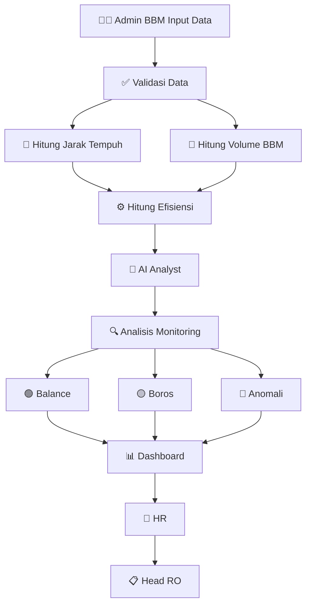
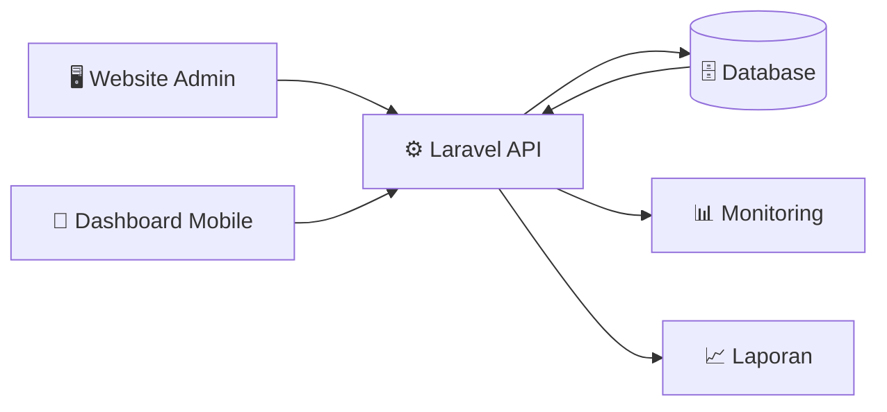
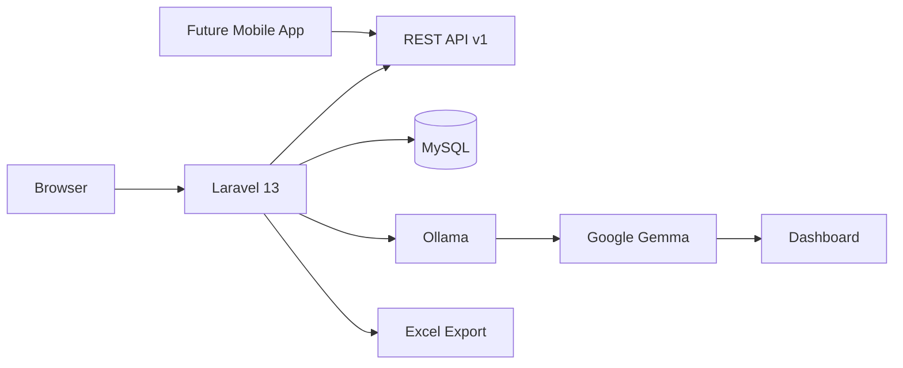

<div align="center">

# Sistem Monitoring BBM Kendaraan Operasional

<br/>

<table border="0" cellspacing="0" cellpadding="0">
  <tr>
    <td align="center" style="padding: 0 20px;">
      
      <br/>
      <b>PT. Telkom Akses Binjai</b>
    </td>
    <td align="center" style="padding: 0 20px; font-size: 28px; font-weight: bold; color: #888;">
      ×
    </td>
    <td align="center" style="padding: 0 20px;">
      
      <br/>
      <b>Universitas Negeri Padang</b>
    </td>
  </tr>
</table>

<br/>


**Proyek Magang Mahasiswa Informatika**

**Ramzy Junfaris Hamonangan**
Program Studi Informatika · Fakultas Teknik · Universitas Negeri Padang

</div>

---

## 📋 Tentang Proyek

Sistem Monitoring BBM Kendaraan Operasional merupakan aplikasi berbasis web yang dikembangkan untuk membantu proses **pencatatan, monitoring, dan evaluasi** penggunaan bahan bakar kendaraan operasional di PT. Telkom Akses Binjai.

Sistem ini dibangun sebagai bagian dari kegiatan **Magang Mahasiswa Universitas Negeri Padang** dan telah melalui proses diskusi serta validasi kebutuhan bersama pihak HR dan Head of Regional Office (Head RO) PT. Telkom Akses Binjai.

Aplikasi dirancang untuk **menggantikan proses pencatatan manual** sehingga data penggunaan BBM dapat terdokumentasi dengan lebih rapi, terstruktur, dan mudah dianalisis.

Seiring perkembangan proyek, aplikasi kini telah mendukung cakupan yang lebih luas, meliputi:

- 📊 **Operational Monitoring** — pencatatan dan pemantauan penggunaan BBM kendaraan operasional
- 📈 **Reporting** — rekapitulasi dan export laporan bulanan
- 🔌 **REST API** — integrasi data untuk kebutuhan sistem lain / mobile app di masa depan
- 🤖 **AI Analysis** — analisis efisiensi dan rekomendasi otomatis berbasis AI lokal
- 📄 **Excel Reporting** — export laporan bulanan mengikuti format pelaporan PT. Telkom Akses

> 🚧 **Catatan:** Saat ini sistem sedang berada dalam tahap **verifikasi internal** oleh pihak **HR** dan **Head of Regional Office (Head RO)** PT. Telkom Akses Binjai, sebelum masuk ke tahap deployment produksi.

---

## 🔍 Latar Belakang

Pengelolaan BBM kendaraan operasional merupakan salah satu aktivitas rutin yang dilakukan oleh perusahaan. Pada proses sebelumnya, pencatatan masih dilakukan secara **manual menggunakan bon pembelian dan pencatatan kilometer** kendaraan sehingga:

| # | Permasalahan |
|---|---|
| 1 | ❌ Sulit melakukan monitoring penggunaan BBM |
| 2 | ❌ Sulit mengetahui kendaraan yang boros |
| 3 | ❌ Sulit melakukan rekapitulasi laporan |
| 4 | ❌ Berpotensi terjadi kesalahan pencatatan |
| 5 | ❌ Membutuhkan waktu lebih lama dalam proses evaluasi |

Oleh karena itu dibangun sistem informasi yang mampu membantu proses pencatatan sekaligus monitoring penggunaan BBM kendaraan operasional.

---

## 🎯 Tujuan Pengembangan

- ✅ Mempermudah pencatatan penggunaan BBM kendaraan operasional
- ✅ Menyimpan dokumentasi bon BBM secara digital
- ✅ Menghitung penggunaan BBM secara otomatis
- ✅ Menghitung efisiensi kendaraan berdasarkan jarak tempuh
- ✅ Menampilkan dashboard monitoring penggunaan BBM
- ✅ Membantu HR dan Supervisor melakukan evaluasi penggunaan kendaraan
- ✅ Menyediakan pondasi sistem yang dapat dikembangkan menjadi aplikasi mobile di masa mendatang

---

## ⚡ Fitur Utama

<table>
  <tr>
    <th>🗂️ Manajemen Data</th>
    <th>📊 Monitoring BBM</th>
    <th>📄 Dokumentasi</th>
    <th>📈 Laporan</th>
    <th>🔌 API</th>
    <th>🤖 AI Analyst</th>
  </tr>
  <tr>
    <td>Data Pegawai</td>
    <td>Volume BBM Otomatis</td>
    <td>Upload Foto Bon</td>
    <td>Rekap Penggunaan BBM</td>
    <td>API Data Perjalanan</td>
    <td>Analisis Efisiensi Otomatis</td>
  </tr>
  <tr>
    <td>Data Kendaraan</td>
    <td>Perhitungan Jarak Tempuh</td>
    <td>Nomor Bon</td>
    <td>Rekap Efisiensi Pegawai</td>
    <td>API Rekap Monitoring</td>
    <td>Rekomendasi Otomatis</td>
  </tr>
  <tr>
    <td>Data Perjalanan</td>
    <td>Efisiensi Kendaraan</td>
    <td>Riwayat Perjalanan</td>
    <td>Dashboard Monitoring (Operational Dashboard)</td>
    <td>API Detail Perjalanan</td>
    <td>Berjalan Lokal (Ollama + Gemma)</td>
  </tr>
  <tr>
    <td>Data Pembelian BBM</td>
    <td>Status Balance / Boros / Anomali</td>
    <td></td>
    <td>Export Excel Bulanan (Format PT. Telkom Akses)</td>
    <td>REST API v1</td>
    <td></td>
  </tr>
</table>

### Status Monitoring Kendaraan

| Status | Indikator | Keterangan |
|--------|-----------|------------|
| 🟢 **Balance** | Efisiensi normal | Penggunaan BBM sesuai standar |
| 🟡 **Boros** | Konsumsi tinggi | Penggunaan BBM di atas rata-rata |
| 🔴 **Anomali** | Perlu investigasi | Terdapat ketidakwajaran pada data |

> ⚠️ Status ini digunakan sebagai **indikator monitoring** dan bukan sebagai alat pembuktian kecurangan.

---

## 🧮 Algoritma Perhitungan

### Jarak Tempuh
```
Jarak Tempuh = KM Akhir - KM Awal
```

### Volume BBM
```
Volume BBM = Nominal Bon / Harga Per Liter
```

### Efisiensi Kendaraan
```
Efisiensi = Jarak Tempuh / Volume BBM
```

### Contoh Perhitungan

```
KM Awal     : 12.450 km
KM Akhir    : 12.680 km
Nominal Bon : Rp 150.000
Harga/Liter : Rp 10.000

─────────────────────────────
Jarak Tempuh : 12.680 - 12.450 = 230 km
Volume BBM   : 150.000 / 10.000 = 15 liter
Efisiensi    : 230 / 15 = 15,3 km/liter → 🟢 Balance
```

---

## 🔄 Flow Sistem



---

## 🔌 Flow API



---

## 🏗️ Arsitektur Sistem



---

## 🛠️ Teknologi yang Digunakan

### Backend
| Teknologi | Versi | Peran |
|-----------|-------|-------|
| PHP | 8.3 | Runtime backend |
| Laravel | 13 | Framework utama |

### Database
| Teknologi | Peran |
|-----------|-------|
| MySQL / MariaDB | Penyimpanan data utama |

### Frontend
| Teknologi | Peran |
|-----------|-------|
| Blade Template | Template engine Laravel |
| Bootstrap | Komponen UI |
| AdminLTE | Dashboard admin |
| AOS (Animate On Scroll) | Animasi transisi antar elemen UI |

### AI & Analisis Otomatis
| Teknologi | Peran |
|-----------|-------|
| Ollama | Runtime untuk menjalankan Large Language Model secara lokal |
| Google Gemma | Model AI yang digunakan untuk analisis efisiensi & rekomendasi |

### Library Tambahan
| Library | Peran |
|---------|-------|
| Laravel DOMPDF | Export laporan PDF |
| Laravel Excel | Export laporan Excel bulanan |
| Laravel Tinker | Debugging & REPL |

### API
| Jenis | Format |
|-------|--------|
| REST API Laravel (v1) | JSON Response |

---

## 👥 Struktur Pengguna Sistem

```
┌─────────────────────────────────────────────────────────┐
│                     SISTEM BBM                          │
│                                                         │
│  🔧 Admin BBM      👤 HR           🔍 Supervisor        │
│  ─────────────    ─────────────   ─────────────────     │
│  Input Data BBM   Monitoring BBM  Monitor Kendaraan     │
│  Upload Bon       Rekapitulasi    Monitor Efisiensi      │
│  Kelola Trip      Data                                  │
│                                                         │
│                   📋 Head RO                            │
│                   ─────────────────                     │
│                   Dashboard Monitor                     │
│                   Evaluasi Operasional                  │
└─────────────────────────────────────────────────────────┘
```

---

## 🤖 AI Integration

Sistem ini telah terintegrasi dengan **Large Language Model (LLM) yang berjalan secara lokal**, menggunakan **Ollama** sebagai runtime dan **Google Gemma** sebagai model AI.

Fitur AI Analyst membantu:

- 📊 Menganalisis pola konsumsi BBM kendaraan operasional
- ⚙️ Mengevaluasi efisiensi operasional berdasarkan data perjalanan
- 💡 Memberikan rekomendasi otomatis (misal: kendaraan yang perlu pengecekan, potensi pemborosan, dsb.)

**Poin penting:**

- ✅ AI berjalan **sepenuhnya secara lokal** di server/komputer yang menjalankan Ollama
- ✅ **Tidak membutuhkan API AI berbayar** dari penyedia cloud manapun
- ✅ Data kendaraan dan perjalanan tidak perlu dikirim ke pihak ketiga untuk dianalisis

---

## 🔌 REST API v1

REST API Version 1 kini tersedia untuk mendukung integrasi dengan sistem lain maupun pengembangan aplikasi mobile di masa depan.

| Method | Endpoint | Keterangan |
|--------|----------|------------|
| GET | `/api/v1/dashboard` | Ringkasan data monitoring BBM |
| GET | `/api/v1/pegawai` | Daftar data pegawai |
| GET | `/api/v1/kendaraan` | Daftar data kendaraan |
| GET | `/api/v1/perjalanan` | Daftar data perjalanan |
| GET | `/api/v1/ai-analysis` | Hasil analisis & rekomendasi dari AI Analyst |

> Seluruh endpoint mengembalikan response dalam format **JSON**.

---

## 🗺️ Roadmap Pengembangan

### ✅ Tahap 1 — Core System (Selesai)

- [x] CRUD Pegawai
- [x] CRUD Kendaraan
- [x] CRUD Perjalanan
- [x] Upload Bon BBM
- [x] Monitoring Efisiensi
- [x] Dashboard Monitoring
- [x] REST API v1
- [x] Export Excel Bulanan
- [x] AI Analyst (Ollama + Google Gemma)

### 🔎 Tahap Saat Ini — Verifikasi Internal

- [ ] Validasi oleh HR
- [ ] Validasi oleh Head of Regional Office (Head RO)
- [ ] Pengumpulan feedback sebelum deployment produksi

### 🔄 Tahap 2 — Pelaporan Lanjutan (Dalam Rencana)

- [ ] Export PDF
- [ ] Filter Periode Laporan

### 📱 Tahap 3 — Mobile & Integrasi (Direncanakan)

- [ ] Aplikasi Mobile Flutter
- [ ] Dashboard Monitoring Mobile
- [ ] Role Permission (multi-level akses pengguna)
- [ ] Integrasi Server Perusahaan (Company Deployment)

---

## 🚦 Status Proyek

> 🚧 **Development & Internal Verification**
>
> Proyek ini dikembangkan sebagai bagian dari kegiatan Magang Mahasiswa Universitas Negeri Padang di PT. Telkom Akses Binjai, dan saat ini sedang berada dalam tahap **verifikasi internal oleh HR dan Head of Regional Office (Head RO)** sebelum masuk ke tahap deployment produksi.

---

## 👨‍💻 Pengembang

<div align="center">

| | |
|---|---|
| **Nama** | Ramzy Junfaris Hamonangan |
| **Program Studi** | Informatika |
| **Fakultas** | Teknik — Universitas Negeri Padang |
| **Kegiatan** | Proyek Magang PT. Telkom Akses Binjai |
| **Tahun** | 2026 |

</div>

---

<div align="center">

### 🚧 Development & Internal Verification

Proyek ini sedang dikembangkan sebagai bagian dari program magang di PT. Telkom Akses Binjai dan sedang menjalani proses **verifikasi internal oleh HR dan Head of Regional Office** sebelum masuk ke tahap deployment produksi.

<sub>© 2026 · Ramzy Junfaris Hamonangan · PT. Telkom Akses Binjai × Universitas Negeri Padang</sub>

</div>
